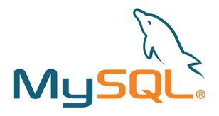

# learn to code

This is the repo for learning how to code. The lessons are divided into several categories for easy reading. The lessons also includes some test scripts and sample codes to better understand the concept

### Algorithms

Algorithms are a set of commands or rules that if run correctly, will produce consistent result everytime it is executed.
In programming, an algorithm is expressed through a specific syntax that corresponds to the programming language (or prolang to be short) and will always produce the same output given the same input.

Let's take a look at some algorithm practices using JavaScript to help you better understand the concept and shape the way to approach a problem. Remember, there is no *right way* to approach a problem. But, there is a *best practice* so that other programmers will understand easily what we have done and what we aim to achieve.

#### Javascript

Understanding JavaScript it essential to a successful web developer. Most of the scripts witten nowadays, especially in **Front end** development are written mostly, if not entirely in JavaScript. That's why, a deep understanding of JavaScript is very important. JavaScript is light-weight, versatile, and quite easy to understand.

For further reading, you can catch up to JavaScript [here](https://www.javascript.com/).

#### PHP

PHP is the most used programming language in website development. It is very powerful and easy to use. Most of the world's website are written in PHP, especially in **Back End** development. Catch up to php [here](http://www.php.net)

#### MySQL

MySQL is an SQL library which handles the SQL database. SQL is short for Structured Query Language, which is the most wide-spread database used in the world. Catch up to MySQL [here](https://www.mysql.com/)

#### Prequisites

You should be able to use `git` for this lesson. At least you should be able to create a new branch, `checkout`, `clone`, `pull`, `add`, `commit`, and `push` your code to the repo. If you are unfamilliar with git, you could learn all about it [here](https://github.com/alvianzf/learn-to-code/blob/master/git/README.md#to-use-git)

#### Let's get started

Here are lists of tasks you should try. Try to do them in order to get the complete sense of the lesson, the examples are in their respective [folders](https://github.com/alvianzf/learn-to-code/tree/master/algorithm):

##### Basic JavaScripts

1. [Comment your code!](https://github.com/alvianzf/learn-to-code/tree/master/algorithm/lesson_1.js)
2. [Constants and Variables](https://github.com/alvianzf/learn-to-code/tree/master/algorithm/lesson_2.js)
3. [Console log!](https://github.com/alvianzf/learn-to-code/tree/master/algorithm/lesson_3.js)
4. [Append and Addition](https://github.com/alvianzf/learn-to-code/tree/master/algorithm/lesson_4.js)
5. [Increment a Number](https://github.com/alvianzf/learn-to-code/tree/master/algorithm/lesson_5.js)
6. [Create a Decimal Number](https://github.com/alvianzf/learn-to-code/tree/master/algorithm/lesson_6.js)
7. [Checking the Data Types](https://github.com/alvianzf/learn-to-code/tree/master/algorithm/lesson_7.js)
8. [Find the Length of a string](https://github.com/alvianzf/learn-to-code/tree/master/algorithm/lesson_8.js)
9. [Conditions](https://github.com/alvianzf/learn-to-code/tree/master/algorithm/lesson_9.js)
10. [Loops](https://github.com/alvianzf/learn-to-code/tree/master/algorithm/lesson_10.js)
11. [Working With Arrays](https://github.com/alvianzf/learn-to-code/tree/master/algorithm/lesson_11.js)
12. [Manipulating the Array](https://github.com/alvianzf/learn-to-code/tree/master/algorithm/lesson_12.js)
13. [Objects](https://github.com/alvianzf/learn-to-code/tree/master/algorithm/lesson_13.js)
14. [Functions](https://github.com/alvianzf/learn-to-code/tree/master/algorithm/lesson_14.js)

##### Basic PHP (PHP: Hypertext Preprocessor)

1. [Creating a PHP page](https://github.com/alvianzf/learn-to-code/tree/master/algorithm/lesson_php_01.php)
2. [Declaring a Variable](https://github.com/alvianzf/learn-to-code/tree/master/algorithm/lesson_php_02.php)
3. 

##### Basic MySQL

1. [create a table]()
2. [insert a value]()
3. [select all values]()
4. [select a specific value]()
5. [deletes a row]()
6. [update a row]()
7. 

##### Basic Ruby
1. 

##### Basic Java
1. 

##### Code Challenges

1. [Even and Odd](https://github.com/alvianzf/learn-to-code/tree/master/algorithm/tasks/task_1.js) - Find something as an even number or an odd number
2. [Find an Element](https://github.com/alvianzf/learn-to-code/tree/master/algorithm/tasks/task_2.js) - Find a specific element inside an array
3. [Sort the Array](https://github.com/alvianzf/learn-to-code/tree/master/algorithm/tasks/task_3.js) - Sort the Array in an ascending manner
4. [Match Elements](https://github.com/alvianzf/learn-to-code/tree/master/algorithm/tasks/task_4.js) - Match common elements from two arrays
5. [Fibonacci](https://github.com/alvianzf/learn-to-code/tree/master/algorithm/tasks/task_5.js) - Generate a Fibonacci sequence automatically
6. [Prime Numbers](https://github.com/alvianzf/learn-to-code/tree/master/algorithm/tasks/task_6.js) - Generate prime numbers
9. [to be determined later](#code-challenges)