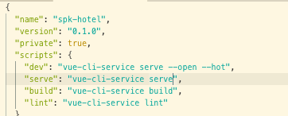

# Vue JS
#### A brief tutorial

VueJs is a progressive JavaScript framework mainly to code the view part of MVC. It is used for building user interfaces and single page applications.

VueJS uses an-HTML based syntax that allows binding the rendered DOM to the underlying Vue instance data.

Vue components extend basic HTML elements to encapsulate reusable code. At a high level, components are custom elements to which the Vue’s compiler attaches behavior. In Vue, a component is essentially a Vue instance with pre-defined options.

By far, Vue Js is the easiest JavaScript framework to learn and work with.

---

### Instalation

First, we must ensure that our device can run nodeJs environment. If you are using Windows, please install Windows Linux Sub-system first.

To know whether node is installed, run this on the terminal:

>`node -v`

it will return the current node version running on the machine. If node is not installed try installing it using:

#### Ubuntu

1. Add NodeJS PPA  

  install curl
  > `sudo apt install curl`

  then the PPA (latest)
  > `curl -sL https://deb.nodesource.com/setup_10.x | sudo bash -`

  or the LTS PPA
  > `curl -sL https://deb.nodesource.com/setup_8.x | sudo bash -`

2. Install NodeJs

  > `sudo apt-get install nodejs`

#### MacOS

> `No need, already pre-installed. LOL`

---

## Vue CLI
It is easier to use `vue-cli` to build a vue application.

> `npm i @vue/cli`

check your version with
> `vue --version`

for further documentation, refer [here](https://cli.vuejs.org/guide/installation.html)

---

## Create a project

to create a project, open up the terminal, type:

> `vue create (project name)`

then pick the best configuration for your project. Wait until it is finished, then `voila` your project is ready to load!

The project will have some basic files and folders needed to run your project. Inside the `src`folder are the files we are most concerned with.

### editing the `package.json`

to have an easier time coding and debugging, you can try editing a script in the `package.json` file.

add:

> `"dev": "vue-cli-service serve --hot --open"`

the `--hot` command will force the hot reload function in vueJs, so you can watch the page change as you code. The `--open` command will open the browser for you! Neat!.

Try typing `npm run dev` to start viewing your page.

## Add Routes

to ensure that you can render pages, we use the `vue-router` library. To do this, type:

> `npm i vue-router`

## Add vuex

vuex is a state manager for vueJs, to install vuex, simply type:

> `npm i vuex`

## Add Vuetify

Vuetify is a material theme component library for vueJs, it is based on the bootstrap modified for vueJs, to add vuetify type in:

>`vue add vuetify`